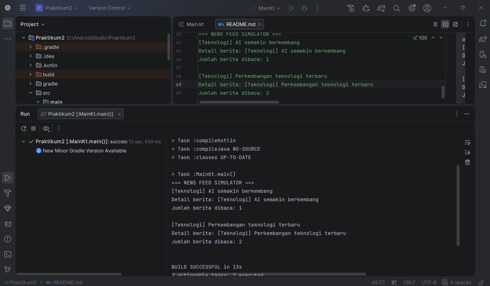

# Praktikum 2 - News Feed Simulator

## Identitas
- Nama: Najlatika
- NIM: 12314078
- Mata Kuliah: Pengembangan Aplikasi Mobile

## Deskripsi
Praktikum 2 membuat aplikasi sederhana berupa News Feed Simulator menggunakan Kotlin dan Kotlin Coroutines.

Program mensimulasikan aliran berita yang muncul secara berkala, kemudian memfilter berita berdasarkan kategori, mengubah format data berita, menghitung jumlah berita yang sudah dibaca, dan mengambil detail berita secara asynchronous.

## Fitur
Program menggunakan:
- Flow untuk menghasilkan data berita setiap 2 detik
- Filter untuk menampilkan berita dengan kategori tertentu
- Map untuk mengubah format data berita
- StateFlow untuk menyimpan jumlah berita yang sudah dibaca
- Coroutines dengan async/await untuk mengambil detail berita secara asynchronous
- Dispatchers.Default untuk menjalankan proses asynchronous
- Catch untuk menangani error pada Flow

## Kategori Berita
Program menggunakan beberapa kategori berita:
- Teknologi
- Olahraga
- Ekonomi

Pada simulasi ini, berita yang ditampilkan difilter berdasarkan kategori:
**Teknologi**

## Cara Menjalankan
1. Buka project menggunakan Android Studio.
2. Pastikan koneksi internet tersedia saat pertama kali melakukan Gradle Sync.
3. Tunggu proses Gradle Sync selesai.
4. Buka file `Main.kt`.
5. Jalankan fungsi `main()` dengan menekan tombol Run.
6. Hasil program dapat dilihat pada Console.

## Contoh Output

```text
=== NEWS FEED SIMULATOR ===
[Teknologi] AI semakin berkembang
Detail berita: [Teknologi] AI semakin berkembang
Jumlah berita dibaca: 1

[Teknologi] Perkembangan teknologi terbaru
Detail berita: [Teknologi] Perkembangan teknologi terbaru
Jumlah berita dibaca: 2
```

## Screenshot Hasil Program

